========================================================
author: Julian Hatwell
date: 2019-02-06

4.1
========================================================
The data set fat, created below, gives a 2 × 2 table recording the level of cholesterol in diet and the presence of symptoms of heart disease for a sample of 23 people.


```
        disease
diet     No Yes
  loChol  6   2
  HiChol  4  11
```

4.1 (a)
=================================================
Use chisq.test(fat) to test for association between diet and disease. Is there any indication that this test may not be appropriate here?


```

	Pearson's Chi-squared test with Yates' continuity correction

data:  fat
X-squared = 3.1879, df = 1, p-value = 0.07418
```

*This test returns a (just) non-significant $\chi^2$ value, although the data clearly suggest non-independence. An odds ratio or log odds ratio would be more appropriate, given the 2x2 structure.*

4.1 (b)
=================================================
Use a fourfold display to test this association visually. Experiment with the different options for standardizing the margins, using the margin argument to fourfold(). What evidence is shown in different displays regarding whether the odds ratio differs significantly from 1?

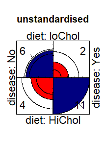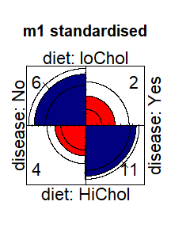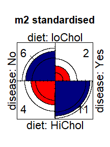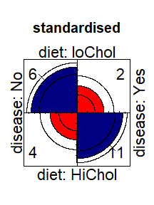

4.1 (b) cont'd
=================================================
*Only the standardised plot can be used to rate the significance of the log odds ratio on both directions. It is significantly different from 1 even with wide confidence intervals.*

4.1 (c)
==============================
oddsratio(fat, log = FALSE) will give you a numerical answer. How does this compare to your visual impression from fourfold displays?


```
 odds ratios for diet and disease 

[1] 8.25
```

*This function call result returns the odds ratio, while the fourfold plot represents the log odds ratio. Visually the larger quadrants are about twice the size of the smaller quadrants, so expectation is a log odds ratio $\approx$ 2.*

*Log(8.25) = 2.1102132*

4.1 (d)
==========================
With such a small sample, Fisher's exact test may be more reliable for statistical inference. Use fisher.test (fat), and compare these results to what you have observed before.


```
p value 0.03930542
```

```
conf int 0.8677432 105.5669
```

```
estimate 7.40185
```

*Note the enormous confidence interval, which does not contain zero. Odds ratio is slightly smaller than the non-exact estimate.*

4.1 (e)
======================================
Write a one-paragraph summary of your findings and conclusions for this data set.

*Taking the fisher exact test results, evidence suggests an odds ratio of 7.4, i.e. 7.4 times more likely to be disease category given a HiChol diet.*

4.2 
===================================
The data set Abortion in vcdExtra gives a 2 × 2 × 2 table of opinions regarding abortion in relation to sex and status of the respondent. This table has the following structure:


```
 table [1:2, 1:2, 1:2] 171 152 138 167 79 148 112 133
 - attr(*, "dimnames")=List of 3
  ..$ Sex             : chr [1:2] "Female" "Male"
  ..$ Status          : chr [1:2] "Lo" "Hi"
  ..$ Support_Abortion: chr [1:2] "Yes" "No"
```

4.2 (a)
===================================
(a)	Taking support for abortion as the outcome variable, produce fourfold displays showing the association with sex, stratified by status.

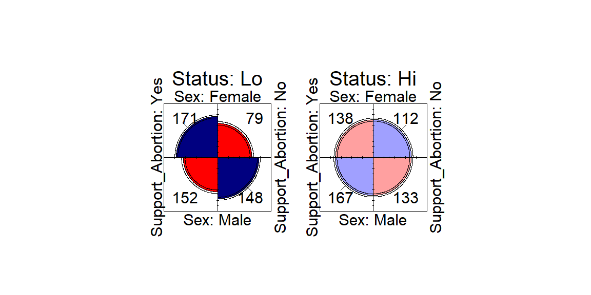

4.2 (b)
==========================================
Do the same for the association of support for abortion with status, stratified by sex.

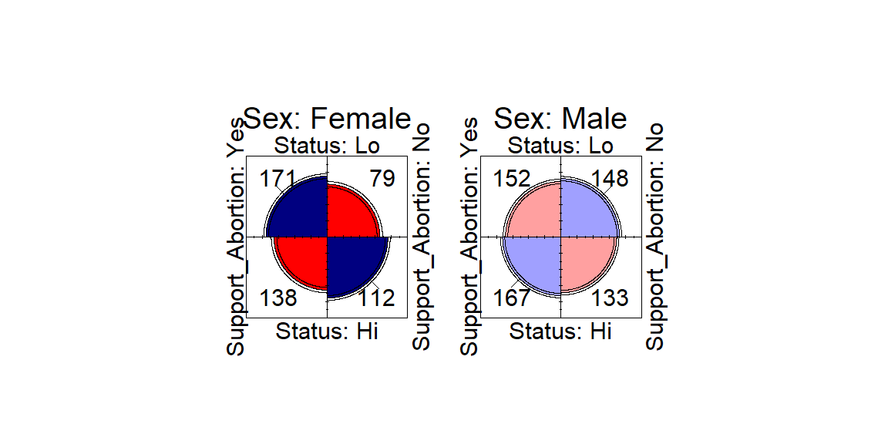

4.2 (c)
=========================================
For each of the problems above, use oddsratio() to calculate the numerical values of the odds ratio, as stratified in the question.


```
 odds ratios for Sex and Support_Abortion by Status 

       Lo        Hi 
2.1075949 0.9812874 
```

```
 odds ratios for Status and Support_Abortion by Sex 

   Female      Male 
1.7567419 0.8179317 
```

*Ratios (log = FALSE) are given*

4.2 (c) cont'd
======================


```
       2.5 %   97.5 %
Lo 1.4855807 2.990047
Hi 0.7000803 1.375449
```

```
           2.5 %   97.5 %
Female 1.2195224 2.530615
Male   0.5932788 1.127652
```

4.2 (d)
=================================
Write a brief summary of how support for abortion depends on sex and status.

*Odds ratio between women's and men's support for abortion is not significantly different from 1 in the high status group, but is $\approx$ 2 in the low status group (men in this group are twice as likely not to support abortion as women in the same group).*

*Odds ratio among men's support for abortion is not significantly different from 1 between the two status groups, but for women is $\approx$ 1.75 comparing the low status group to the high status group (women in the low status group are 1.75 times more likely to support abortion than those in the high status group).*

4.3
===================================
The JobSat table on income and job satisfaction created in Example 2.5 is contained in the vcdExtra package.


```
        satisfaction
income   VeryD LittleD ModerateS VeryS
  < 15k      1       3        10     6
  15-25k     2       3        10     7
  25-40k     1       6        14    12
  > 40k      0       1         9    11
```

4.3 (a)
====================================
Carry out a standard χ2 test for association between income and job satisfaction. Is there any indication that this test might not be appropriate? Repeat this test using simulate.p.value = TRUE to obtain a Monte Carlo test that does not depend on large sample size. Does this change your conclusion?


```

	Pearson's Chi-squared test

data:  JobSat
X-squared = 5.9655, df = 9, p-value = 0.7434
```

*The test suggests independence between the variables, with or without simulation. This may not be correct.*

4.3 (b)
===========================
Both variables are ordinal, so CMH tests may be more powerful here. Carry out that analysis. What do you conclude?


```
Cochran-Mantel-Haenszel Statistics for income by satisfaction 

                 AltHypothesis  Chisq Df     Prob
cor        Nonzero correlation 2.9830  1 0.084144
rmeans  Row mean scores differ 4.4774  3 0.214318
cmeans  Col mean scores differ 3.1036  3 0.375931
general    General association 5.9034  9 0.749549
```

4.3 (b)
===========================
*The General Association test is similar to $\chi^2$ which has not been conclusive. Only the results are significant for the Nonzero correlation test, indicating a linear association.*

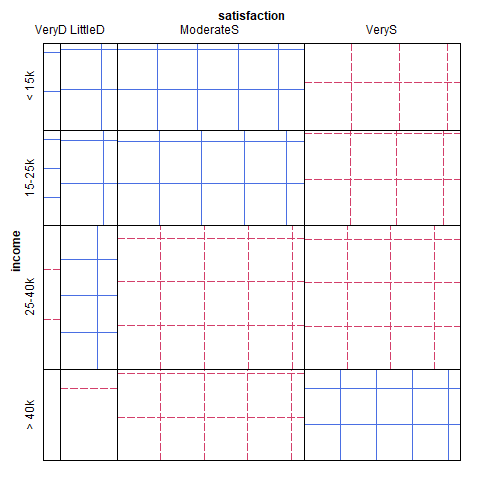

4.4
===========================
The Hospital data in vcd gives a 3 × 3 table relating the length of stay (in years) of 132 long-term schizophrenic patients in two London mental hospitals with the frequency of visits by family and friends.


```
                   Length of stay
Visit frequency     2-9 10-19 20+
  Regular            43    16   3
  Less than monthly   6    11  10
  Never               9    18  16
```

4.4 (a)
==========================
Carry out a χ2 test for association between the two variables.


```

	Pearson's Chi-squared test

data:  Hospital
X-squared = 35.171, df = 4, p-value = 4.284e-07
```

*This is a significant test result indicating that the variables are not independent.*

4.4 (b)
==========================
Use assocstats() to compute association statistics. How would you describe the strength of association here?


```
                    X^2 df   P(> X^2)
Likelihood Ratio 38.353  4 9.4755e-08
Pearson          35.171  4 4.2842e-07

Phi-Coefficient   : NA 
Contingency Coeff.: 0.459 
Cramer's V        : 0.365 
```

*From the Cramer's V statistic which varies from 0 (no association) to 1 (perfect association) there appears to be a moderate association between the variables.*

4.4 (c)
=========================
Produce an association plot for these data, with visit frequency as the vertical variable. Describe the pattern of the relation you see here.

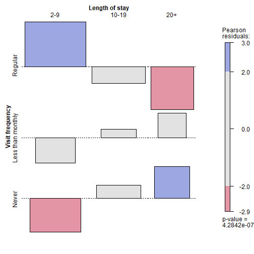

4.4 (d)
============================
Both variables can be considered ordinal, so CMHtest() may be useful here. Carry out that analysis. Do any of the tests lead to different conclusions?


```
Cochran-Mantel-Haenszel Statistics for Visit frequency by Length of stay 

                 AltHypothesis  Chisq Df       Prob
cor        Nonzero correlation 29.138  1 6.7393e-08
rmeans  Row mean scores differ 34.391  2 3.4044e-08
cmeans  Col mean scores differ 29.607  2 3.7233e-07
general    General association 34.905  4 4.8596e-07
```

4.4 (conclusions)

*The cases tend toward more, frequent shorter visits or rare longer visits. Although the Pearson't residuals in the plot never exceed 4 (saturated colouring).*

*All the CMH tests are highly significant. The tests indicate that there are general and linear associations.*

4.5
==================================
Continuing with the Hospital data:

(a)	Try one or more of the following other functions for visualizing two-way contingency tables with this data: plot(), tile(), mosaic(), and spineplot(). [For all except spineplot(), it is useful to include the argument shade=TRUE].

(b)	Comment on the differences among these displays for understanding the relation between visits and length of stay.

4.5 Tile
===================
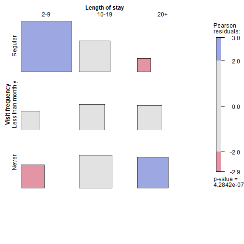

4.5 Mosaic
=============================
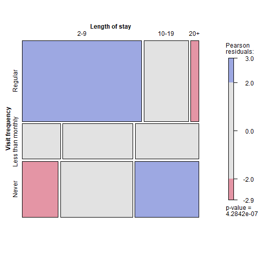

4.5 Spine
=======================
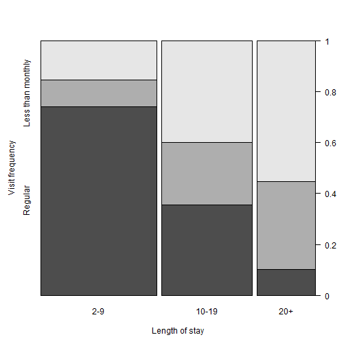

4.5 Notes
==========================
*Each plot type has it's strengths and emphaisis. The assocplot focuses on the scale of the magnitude of the differences from expected. The spine plot highlights the trend across the groups. The mosaic appears to pick out a similarity in the "less than monthly" and the "Never" groups' length of stay.*

4.6
=========================
The two-way table Mammograms in vcdExtra gives ratings on the severity of diagnosis of 110 mammograms by two raters.


```
          Reader1
Reader2    Absent Minimal Moderate Severe
  Absent       34      10        2      0
  Minimal       6       8        8      2
  Moderate      2       5        4     12
  Severe        0       1        2     14
```

4.6 (a)
================================
Assess the strength of agreement between the raters using Cohen's κ, both unweighted and weighted.


```
            value     ASE      z  Pr(>|z|)
Unweighted 0.3713 0.06033  6.154 7.560e-10
Weighted   0.7641 0.03996 19.122 1.667e-81
```

```
            
Kappa              lwr       upr
  Unweighted 0.2530339 0.4895358
  Weighted   0.6857977 0.8424415
```

4.6 (b)
===============================
Use agreementplot() for a graphical display of agreement here.


4.6 (c)
======================
Compare the Kappa measures with the results from assocstats(). What is a reasonable interpretation of each of these measures?


```
                    X^2 df   P(> X^2)
Likelihood Ratio 92.619  9 4.4409e-16
Pearson          83.516  9 3.2307e-14

Phi-Coefficient   : NA 
Contingency Coeff.: 0.657 
Cramer's V        : 0.503 
```

4.6 Interpretation
======================
*The assocstats results report a strong association between the variables. However this is expected due to the nature of the data set (2 ratings on the same cases).*

*The Kappa is a more useful measure for this kind of data as it reports on the level of agerement of the two raters and it's possible to consider complete agreement and partial (out by one level) agreement using weightings.*

4.7
===============================
Agresti and Winner (1997) gave the data in Table 4.8 on the ratings of 160 movies by the reviewers Gene Siskel and Roger Ebert for the period from April 1995 through September 1996. The rating categories were Con (“thumbs down”), Mixed, and Pro (“thumbs up”).


```
       Ebert
Siskel  Con Mixed Pro
  Con    24     8  13
  Mixed   8    13  11
  Pro    10     9  64
```

4.7 (a)
================================
(a)	Assess the strength of agreement between the raters using Cohen's κ, both unweighted and weighted.


```
            value     ASE     z  Pr(>|z|)
Unweighted 0.3888 0.05979 6.503 7.870e-11
Weighted   0.4580 0.07184 6.375 1.832e-10
```

*There exists agreement between the two raters, but they are only moderately aligned even under the weighted measure.*

4.7 (b)
============================
Use agreementplot() for a graphical display of agreement here.

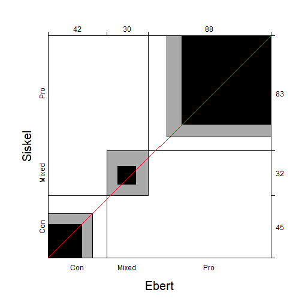

4.7 (c)
===============================
Assess the hypothesis that the ratings are symmetric around the main diagonal, using an appropriate χ2 test. Hint: Symmetry for a square table T means that tij = tji for i ≠ j. The expected frequencies under the hypothesis of symmetry are the average of the off-diagonal cells, E = (T + TT)/2.


```

	Chi-squared test for given probabilities

data:  offDiag
X-squared = 1.9153, df = 5, p-value = 0.8607
```

*This $\chi^2$ result for the off diagonal elements gives no evidence that these differ significantly from expected values. The Null hypothesis holds that these elements are independently distributed.*

4.7 (d)
======================
Compare the results with the output of mcnemar.test().


```

	McNemar's Chi-squared test

data:  MovieRating
McNemar's chi-squared = 0.5913, df = 3, p-value = 0.8984
```

*These results show a no evidence at all for a lack of symmetry. The statistic is very close to the chi square but more significant as there are few DF.*

4.8
==================
For the VisualAcuity data set:

(a) Use the code shown in the text to create the table form, VA.tab.


```
, , gender = male

               Left eye grade
Right eye grade high    2    3  low
           high  821  112   85   35
           2     116  494  145   27
           3      72  151  583   87
           low    43   34  106  331

, , gender = female

               Left eye grade
Right eye grade high    2    3  low
           high 1520  266  124   66
           2     234 1512  432   78
           3     117  362 1772  205
           low    36   82  179  492
```

4.8 (b)
===================================
Perform the CMH tests for this table.

*Combined male and female results*


```
Cochran-Mantel-Haenszel Statistics for Right eye grade by Left eye grade 

                 AltHypothesis   Chisq Df Prob
cor        Nonzero correlation  5237.7  1    0
rmeans  Row mean scores differ  5257.1  3    0
cmeans  Col mean scores differ  5261.4  3    0
general    General association 11478.1  9    0
```

4.8 (b) cont'd
===================================
Perform the CMH tests for this table.

*Male results*


```
Cochran-Mantel-Haenszel Statistics for Right eye grade by Left eye grade 

                 AltHypothesis  Chisq Df Prob
cor        Nonzero correlation 1554.6  1    0
rmeans  Row mean scores differ 1556.3  3    0
cmeans  Col mean scores differ 1556.6  3    0
general    General association 3303.3  9    0
```

4.8 (b)
===================================
Perform the CMH tests for this table.

*Female results*


```
Cochran-Mantel-Haenszel Statistics for Right eye grade by Left eye grade 

                 AltHypothesis  Chisq Df Prob
cor        Nonzero correlation 3691.3  1    0
rmeans  Row mean scores differ 3709.4  3    0
cmeans  Col mean scores differ 3724.0  3    0
general    General association 8095.8  9    0
```

4.8 (c)
==================================
Use the woolf_test() described in Section 4.3.2 to test whether the association between left and right eye acuity can be considered the same for men and women.


```

	Woolf-test on Homogeneity of Odds Ratios (no 3-Way assoc.)

data:  VA
X-squared = 0.089189, df = 1, p-value = 0.7652
```

*There is no evidence of difference between men and women. CMH test is sensitive to number of readings in each stratum.*

4.9
==============================
The graph in Figure 4.23 may be misleading, in that it doesn't take into account of the differing capacities of the 18 life boats on the Titanic, given in the variable cap in the Lifeboats data.

(a)	Calculate a new variable, pctloaded, as the percentage loaded relative to the boat capacity.

(b)	Produce a plot similar to Figure 4.23, showing the changes over time in this measure.

4.9 original plot
============================

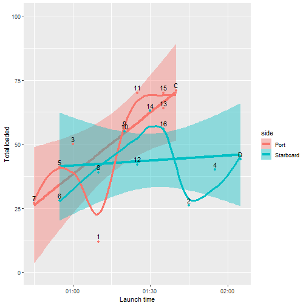


4.9 new plot
==========================

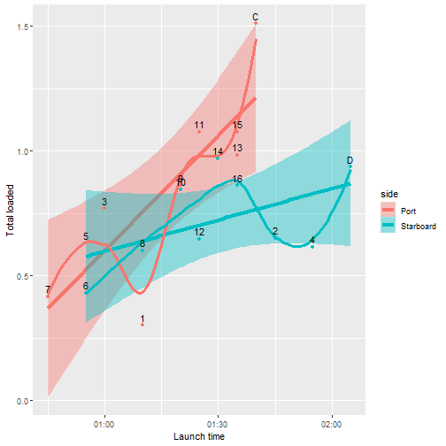
